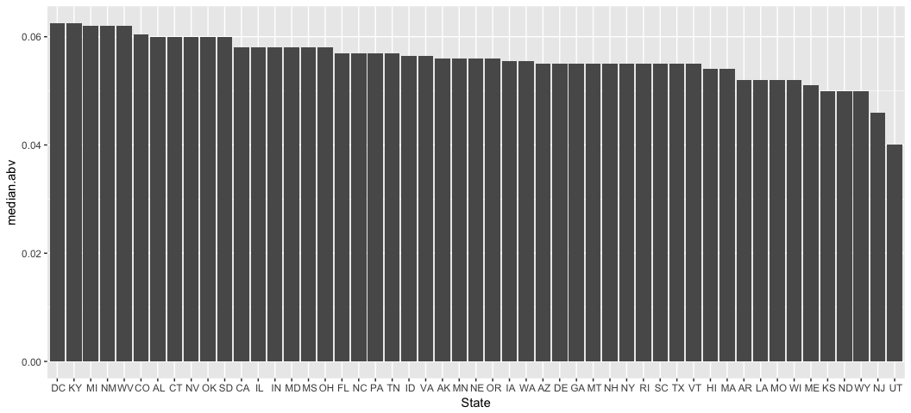
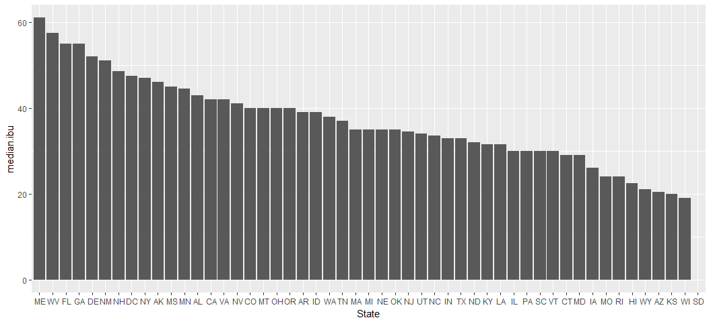
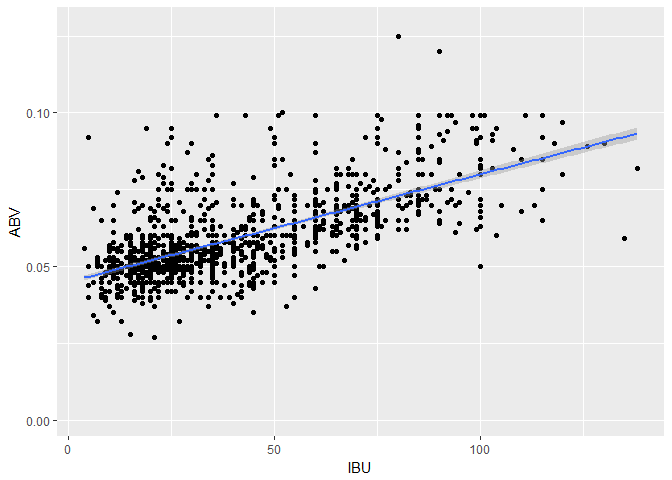

# Case Study 1 - US Breweries
Brychan Manry and Patricia Goresen  
October 23, 2017  


## Ingest Data

```r
beers <- read.csv("./rawdata/Beers.csv") %>% rename(Beer_Name = Name)
breweries <- read.csv("./rawdata/Breweries.csv") %>% rename(Brewery_Name = Name)
```


## Q1: How many breweries are present in each state?

```r
table(breweries$State)
```

```
## 
##  AK  AL  AR  AZ  CA  CO  CT  DC  DE  FL  GA  HI  IA  ID  IL  IN  KS  KY 
##   7   3   2  11  39  47   8   1   2  15   7   4   5   5  18  22   3   4 
##  LA  MA  MD  ME  MI  MN  MO  MS  MT  NC  ND  NE  NH  NJ  NM  NV  NY  OH 
##   5  23   7   9  32  12   9   2   9  19   1   5   3   3   4   2  16  15 
##  OK  OR  PA  RI  SC  SD  TN  TX  UT  VA  VT  WA  WI  WV  WY 
##   6  29  25   5   4   1   3  28   4  16  10  23  20   1   4
```


## Q2: Merge data and print first and last six observations

```r
beers <- merge(beers, breweries, by.x = "Brewery_id", by.y = "Brew_ID")
head(beers, n=6)
```

```
##   Brewery_id     Beer_Name Beer_ID   ABV IBU
## 1          1  Get Together    2692 0.045  50
## 2          1 Maggie's Leap    2691 0.049  26
## 3          1    Wall's End    2690 0.048  19
## 4          1       Pumpion    2689 0.060  38
## 5          1    Stronghold    2688 0.060  25
## 6          1   Parapet ESB    2687 0.056  47
##                                 Style Ounces       Brewery_Name
## 1                        American IPA     16 NorthGate Brewing 
## 2                  Milk / Sweet Stout     16 NorthGate Brewing 
## 3                   English Brown Ale     16 NorthGate Brewing 
## 4                         Pumpkin Ale     16 NorthGate Brewing 
## 5                     American Porter     16 NorthGate Brewing 
## 6 Extra Special / Strong Bitter (ESB)     16 NorthGate Brewing 
##          City State
## 1 Minneapolis    MN
## 2 Minneapolis    MN
## 3 Minneapolis    MN
## 4 Minneapolis    MN
## 5 Minneapolis    MN
## 6 Minneapolis    MN
```

```r
tail(beers, n=6)
```

```
##      Brewery_id                 Beer_Name Beer_ID   ABV IBU
## 2405        556             Pilsner Ukiah      98 0.055  NA
## 2406        557  Heinnieweisse Weissebier      52 0.049  NA
## 2407        557           Snapperhead IPA      51 0.068  NA
## 2408        557         Moo Thunder Stout      50 0.049  NA
## 2409        557         Porkslap Pale Ale      49 0.043  NA
## 2410        558 Urban Wilderness Pale Ale      30 0.049  NA
##                        Style Ounces                  Brewery_Name
## 2405         German Pilsener     12         Ukiah Brewing Company
## 2406              Hefeweizen     12       Butternuts Beer and Ale
## 2407            American IPA     12       Butternuts Beer and Ale
## 2408      Milk / Sweet Stout     12       Butternuts Beer and Ale
## 2409 American Pale Ale (APA)     12       Butternuts Beer and Ale
## 2410        English Pale Ale     12 Sleeping Lady Brewing Company
##               City State
## 2405         Ukiah    CA
## 2406 Garrattsville    NY
## 2407 Garrattsville    NY
## 2408 Garrattsville    NY
## 2409 Garrattsville    NY
## 2410     Anchorage    AK
```

## Q3: Report the number of NA's in each column

```r
colSums(is.na(beers))
```

```
##   Brewery_id    Beer_Name      Beer_ID          ABV          IBU 
##            0            0            0           62         1005 
##        Style       Ounces Brewery_Name         City        State 
##            0            0            0            0            0
```

## Q4: Compute the median alcohol content and international bitterness unit for each state. Plot a bar chart to compare

```r
# Median ABV and IBU by State Alpha
ggplot(
  bind_rows(
    beers %>% select(State, val = ABV) %>% mutate(var = "ABV"),
    beers %>% select(State, val = IBU) %>% mutate(var = "IBU")) %>%
    group_by(State, var) %>%
    summarise(med.val = median(val, na.rm = TRUE)),
  aes(x = State, fill = var, group = var)) +
  geom_bar(aes(y = med.val), stat = "identity",  position = "dodge") +
  facet_grid(var ~ ., scales = "free_y")
```

```
## Warning: Removed 1 rows containing missing values (geom_bar).
```

<!-- -->

## Q5: Which state has the maximum alcoholic beer? Which state has the most bitter beer?

```r
# Median ABV by state - ordered by median
plot.df <- beers %>% group_by(State) %>% summarise(median.abv = median(ABV, na.rm = TRUE))
plot.df$State <- factor(plot.df$State, levels = plot.df$State[order(plot.df$median.abv, decreasing = TRUE)])
ggplot(plot.df, aes(State, y = median.abv)) + geom_bar(stat = "identity")
```

<!-- -->

```r
# Median IBU by state - ordered by median
plot.df <- beers %>% group_by(State) %>% summarise(median.ibu = median(IBU, na.rm = TRUE))
plot.df$State <- factor(plot.df$State, levels = plot.df$State[order(plot.df$median.ibu, decreasing = TRUE)])
ggplot(plot.df, aes(State, y = median.ibu)) + geom_bar(stat = "identity")
```

```
## Warning: Removed 1 rows containing missing values (position_stack).
```

<!-- -->

## Q6: Summary statistics for the ABV

```r
summary(beers$ABV)
```

```
##    Min. 1st Qu.  Median    Mean 3rd Qu.    Max.    NA's 
## 0.00100 0.05000 0.05600 0.05977 0.06700 0.12800      62
```

## Q7: Is there an apparent relationship between the bitterness of the beer and its alcoholic content?

```r
ggplot(beers, aes(IBU, ABV))+
  geom_point() +
  geom_smooth(method = "lm")
```

```
## Warning: Removed 1005 rows containing non-finite values (stat_smooth).
```

```
## Warning: Removed 1005 rows containing missing values (geom_point).
```

<!-- -->

```r
pander::pander(summary(lm(ABV ~ IBU, data = beers)))
```


-----------------------------------------------------------------
     &nbsp;        Estimate    Std. Error   t value    Pr(>|t|)  
----------------- ----------- ------------ --------- ------------
 **(Intercept)**    0.04493    0.0005177     86.79        0      

     **IBU**       0.0003508   1.036e-05     33.86    3.263e-184 
-----------------------------------------------------------------


--------------------------------------------------------------
 Observations   Residual Std. Error   $R^2$    Adjusted $R^2$ 
-------------- --------------------- -------- ----------------
     1405             0.01007         0.4497       0.4493     
--------------------------------------------------------------

Table: Fitting linear model: ABV ~ IBU


